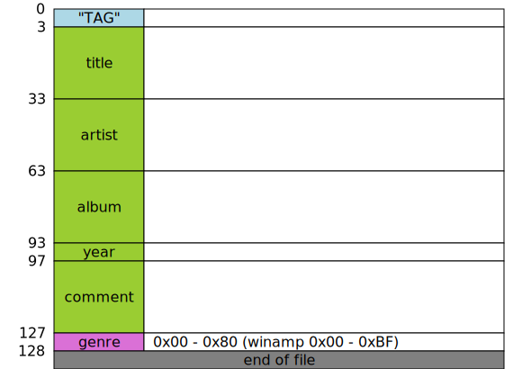

- [ID3v1.0](#id3v10)
- [ID3v1.1](#id3v11)
- [ID3v1.2](#id3v12)
- [ID3v1 Enhanced](#id3v1-enhanced)
- [ID3v2.2](#id3v22)
  - [frame](#frame)
- [ID3v2.3](#id3v23)
  - [extended header](#extended-header)
  - [frame](#frame-1)
- [ID3v2.4](#id3v24)
  - [extended header](#extended-header-1)
  - [frame](#frame-2)
  - [footer](#footer)

# values

Text = "XXXX"\
Integers = $ xx xx xx xx\
Synchsafe integers = %0xxxxxxx 0xxxxxxx 0xxxxxxx 0xxxxxxx\
($ xx is hexa number, %xxxxxxxx is binary number)

# ID3v1.0

https://id3.org/ID3v1

|start|end|length|name|value|info|
|----:|----:|----:|:----|:----|:----|
|1|3|3|header|"TAG"||
|4|33|30|title|Text||
|34|63|30|artist|Text||
|64|93|30|album|Text||
|94|97|4|year|Text|"yyyy"|
|98|127|30|comment|Text||
||128|1|genre|Integers|$ 00 - $ 80 (winamp $ 00 - $ BF)|
||||||end of file|

# ID3v1.1

https://id3.org/ID3v1

|start|end|length|name|value|info|
|----:|----:|----:|:----|:----|:----|
|1|3|3|header|"TAG"||
|4|33|30|title|Text||
|34|63|30|artist|Text||
|64|93|30|album|Text||
|94|97|4|year|Text|"yyyy"|
|98|125|28|comment|Text||
||126|1|separator|$ 00||
||127|1|album track|Integers||
||128|1|genre|Integers|$ 00 - $ 80 (winamp $ 00 - $ BF)|
||||||end of file|

# ID3v1.2

https://www.birdcagesoft.com/ID3v12.txt

|start|end|length|name|value|info|
|----:|----:|----:|:----|:----|:----|
|1|3|3|header|"EXT"||
|4|33|30|last half of title|Text||
|34|63|30|last half of artist|Text||
|64|93|30|last half of album|Text||
|94|108|15|last half of comment|Text||
|109|128|20|sub genre|Text||
||||||ID3v1.1 tag|
|129|131|3|header|"TAG"||
|132|161|30|first half of title|Text||
|162|191|30|first half of artist|Text||
|192|221|30|first half of album|Text||
|222|225|4|year|Text|"yyyy"|
|226|253|28|first half of comment|Text||
||254|1|separator|$ 00||
||255|1|album track|Integers||
||256|1|genre|Integers|$ 00 - $ 80 (winamp $ 00 - $ BF)|
||||||end of file|

# ID3v1 Enhanced

https://en.wikipedia.org/wiki/ID3#Enhanced_TAG[10]
https://web.archive.org/web/20120310015458/http://www.fortunecity.com/underworld/sonic/3/id3tag.html

|start|end|length|name|value|info|
|----:|----:|----:|:----|:----|:----|
|1|4|4|header|"TAG+"||
|5|64|60|title|Text||
|65|124|60|artist|Text||
|125|184|60|album|Text||
||185|1|speed|Integers|$ 00 = unset $ 01 = slow $ 02 = medium $ 03 = fast $ 04 = hardcore|
|186|215|30|genre|Text||
|216|221|6|start time|Text|"mmm:ss"|
|222|227|6|end time|Text|"mmm:ss"|
||||||ID3v1.1 tag|
|228|230|3|header|"TAG"||
|231|260|30|title|Text||
|261|290|30|artist|Text||
|291|320|30|album|Text||
|321|324|4|year|Text|"yyyy"|
|325|352|28|comment|Text||
||353|1|separator|$ 00||
||354|1|album track|Integers||
||355|1|genre|Integers|$ 00 - $ 80 (winamp $ 00 - $ BF)|
||||||end of file|

# ID3v2.2

https://id3.org/id3v2-00

|start|end|length|name|value|info|
|----:|----:|----:|:----|:----|:----|
||||||start of file|
|1|3|3|header|"ID3"||
|4|5|2|version|$ 02 00||
||6|1|flags|%ab000000|a = unsynchronisation b = compression|
|7|10|4|size|Synchsafe integers|exclude header (10 Bytes)|
|11|...|size|frames|||

## frame

|start|end|length|name|value|info|
|----:|----:|----:|:----|:----|:----|
|1|3|3|frame identifier|Text|A-Z and 0-9|
|4|6|3|frame size|Integers|exclude header (6 Bytes)|
|7|...|size|frame data||

# ID3v2.3

https://id3.org/d3v2.3.0

|start|end|length|name|value|info|
|----:|----:|----:|:----|:----|:----|
||||||start of file|
|1|3|3|header|"ID3"||
|4|5|2|version|$ 03 00||
||6|1|flags|%abc00000|a = Unsynchronisation b = Extended header c = Experimental indicator|
|7|10|4|size|Synchsafe integers|exclude header (10 Bytes)|
|11|...|ex|extended header||if flag b is 1|
|...|...|fr|frames|||

## extended header

|start|end|length|name|value|info|
|----:|----:|----:|:----|:----|:----|
|1|4|4|extended header size|Integers|exclude size (4 Bytes)|
|5|6|2|flags|%a0000000 00000000|a = CRC data present|
|7|10|4|padding size|Integers||
|11|14|4|CRC|Byte datas|if flag a is 1|

## frame

|start|end|length|name|value|info|
|----:|----:|----:|:----|:----|:----|
|1|4|4|frame ID|Text|A-Z and 0-9|
|5|8|4|frame size|Integers|exclude header (10 Bytes)|
|9|10|2|frame flags|%abc00000 ijk00000|a = Tag alter preservation b = File alter preservation c = Read only i = Compression j = Encryption k = Grouping identity|
|11|...|size|frame data|||

# ID3v2.4

https://id3.org/id3v2.4.0-structure
https://id3.org/id3v2.4.0-frames

|start|end|length|name|value|info|
|----:|----:|----:|:----|:----|:----|
||||||start of file|
|1|3|3|header|"ID3"||
|4|5|2|version|$ 04 00||
||6|1|flags|%abcd0000|a = Unsynchronisation b = Extended header c = Experimental indicator d = Footer present|
|7|10|4|size|Synchsafe integers|exclude header (10 Bytes)|
|11|...|ex|extended header||if flag b is 1|
|...|...|fr|frames|||
|...|...|10|footer||if flag d is 1|

## extended header

|start|end|length|name|value|info|
|----:|----:|----:|:----|:----|:----|
|1|4|4|extended header size|Synchsafe integers|whole size (>= 6 Bytes)|
||5|1|flags size|$ 01|
||6|1|flags|%0bcd0000|b = Tag is an update c = CRC data present d = Tag restrictions
||7|1|b data size|$ 00|if flag b is 1|
||8|1|c data size|$ 05|if flag c is 1|
|9|13|5|c data|Byte datas|if flag c is 1|
|14|1|d data size|$ 01|if flag d is 1|
||15|1|d data|%ppqrrstt|p = Tag size restrictions q = Text encoding restrictions r = Text fields size restrictions s = Image encoding restrictions t = Image size restrictions if flag d is 1|

## frame

|start|end|length|name|value|info|
|----:|----:|----:|:----|:----|:----|
|1|4|4|frame ID|Text|A-Z and 0-9|
|5|8|4|frame size|Synchsafe integers|exclude header (10 Bytes)|
|9|10|2|frame flags|%0abc0000 0h00kmnp|a = Tag alter preservation b = File alter preservation c = Read only h = Grouping identity k = Compression m = Encryption n = Unsynchronisation p = Data length indicator|
|11|...|ad|additional information||
|...|...|dt|frame data||

## footer

|start|end|length|name|value|info|
|----:|----:|----:|:----|:----|:----|
|1|3|3|header|"3DI"|
|4|5|2|version|$ 04 00|
||6|1|flags|%abcd0000|a = Unsynchronisation b = Extended header c = Experimental indicator d = Footer present|
|7|10|4|size|Synchsafe integers|exclude header (10 Bytes)|
