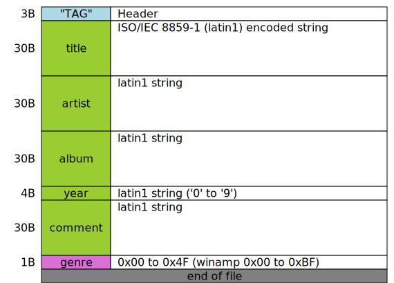
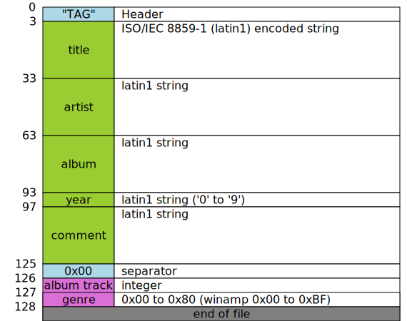
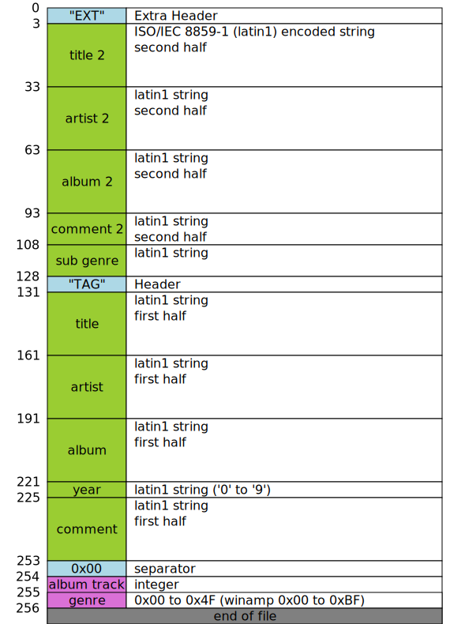
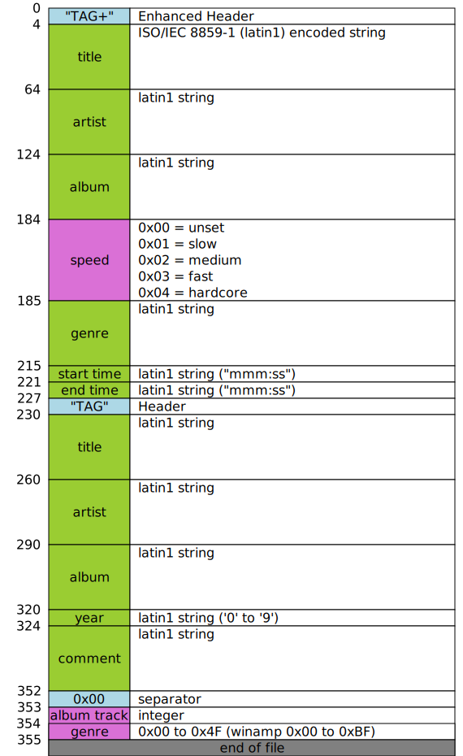

- [ID3v1.0](#id3v10)
- [ID3v1.1](#id3v11)
- [ID3v1.2](#id3v12)
- [ID3v1 Enhanced](#id3v1-enhanced)
- [Genres list](#genres-list)
  - [Winamp extention genres list](#winamp-extention-genres-list)

# ID3v1.0

https://id3.org/ID3v1

# ID3v1.1

https://id3.org/ID3v1

# ID3v1.2

https://www.birdcagesoft.com/ID3v12.txt

# ID3v1 Enhanced

https://en.wikipedia.org/wiki/ID3#Enhanced_TAG[10]
https://web.archive.org/web/20120310015458/http://www.fortunecity.com/underworld/sonic/3/id3tag.html

# Genres list

| id  | genre             |
| --- | ----------------- |
| 00  | Blues             |
| 01  | Classic Rock      |
| 02  | Country           |
| 03  | Dance             |
| 04  | Disco             |
| 05  | Funk              |
| 06  | Grunge            |
| 07  | Hip-Hop           |
| 08  | Jazz              |
| 09  | Metal             |
| 10  | New Age           |
| 11  | Oldies            |
| 12  | Other             |
| 13  | Pop               |
| 14  | Rhythm and Blues  |
| 15  | Rap               |
| 16  | Reggae            |
| 17  | Rock              |
| 18  | Techno            |
| 19  | Industrial        |
| 20  | Alternative       |
| 21  | Ska               |
| 22  | Death Metal       |
| 23  | Pranks            |
| 24  | Soundtrack        |
| 25  | Euro-Techno       |
| 26  | Ambient           |
| 27  | Trip-Hop          |
| 28  | Vocal             |
| 29  | Jazz & Funk       |
| 30  | Fusion            |
| 31  | Trance            |
| 32  | Classical         |
| 33  | Instrumental      |
| 34  | Acid              |
| 35  | House             |
| 36  | Game              |
| 37  | Sound clip        |
| 38  | Gospel            |
| 39  | Noise             |
| 40  | Alternative Rock  |
| 41  | Bass              |
| 42  | Soul              |
| 43  | Punk              |
| 44  | Space             |
| 45  | Meditative        |
| 46  | Instrumental Pop  |
| 47  | Instrumental Rock |
| 48  | Ethnic            |
| 49  | Gothic            |
| 50  | Darkwave          |
| 51  | Techno-Industrial |
| 52  | Electronic        |
| 53  | Pop-Folk          |
| 54  | Eurodance         |
| 55  | Dream             |
| 56  | Southern Rock     |
| 57  | Comedy            |
| 58  | Cult              |
| 59  | Gangsta           |
| 60  | Top 40            |
| 61  | Christian Rap     |
| 62  | Pop/Funk          |
| 63  | Jungle music      |
| 64  | Native US         |
| 65  | Cabaret           |
| 66  | New Wave          |
| 67  | Psychedelic       |
| 68  | Rave              |
| 69  | Showtunes         |
| 70  | Trailer           |
| 71  | Lo-Fi             |
| 72  | Tribal            |
| 73  | Acid Punk         |
| 74  | Acid Jazz         |
| 75  | Polka             |
| 76  | Retro             |
| 77  | Musical           |
| 78  | Rock ’n’ Roll     |
| 79  | Hard Rock         |

## Winamp extention genres list

| id  | genre                  |
| --- | ---------------------- |
| 80  | Folk                   |
| 81  | Folk-Rock              |
| 82  | National Folk          |
| 83  | Swing                  |
| 84  | Fast Fusion            |
| 85  | Bebop                  |
| 86  | Latin                  |
| 87  | Revival                |
| 88  | Celtic                 |
| 89  | Bluegrass              |
| 90  | Avantgarde             |
| 91  | Gothic Rock            |
| 92  | Progressive Rock       |
| 93  | Psychedelic Rock       |
| 94  | Symphonic Rock         |
| 95  | Slow Rock              |
| 96  | Big Band               |
| 97  | Chorus                 |
| 98  | Easy Listening         |
| 99  | Acoustic               |
| 100 | Humour                 |
| 101 | Speech                 |
| 102 | Chanson                |
| 103 | Opera                  |
| 104 | Chamber Music          |
| 105 | Sonata                 |
| 106 | Symphony               |
| 107 | Booty Bass             |
| 108 | Primus                 |
| 109 | Porn Groove            |
| 110 | Satire                 |
| 111 | Slow Jam               |
| 112 | Club                   |
| 113 | Tango                  |
| 114 | Samba                  |
| 115 | Folklore               |
| 116 | Ballad                 |
| 117 | Power Ballad           |
| 118 | Rhythmic Soul          |
| 119 | Freestyle              |
| 120 | Duet                   |
| 121 | Punk Rock              |
| 122 | Drum Solo              |
| 123 | A cappella             |
| 124 | Euro-House             |
| 125 | Dance Hall             |
| 126 | Goa music              |
| 127 | Drum & Bass            |
| 128 | Club-House             |
| 129 | Hardcore Techno        |
| 130 | Terror                 |
| 131 | Indie                  |
| 132 | BritPop                |
| 133 | Negerpunk              |
| 134 | Polsk Punk             |
| 135 | Beat                   |
| 136 | Christian Gangsta Rap  |
| 137 | Heavy Metal            |
| 138 | Black Metal            |
| 139 | Crossover              |
| 140 | Contemporary Christian |
| 141 | Christian Rock         |
| 142 | Merengue               |
| 143 | Salsa                  |
| 144 | Thrash Metal           |
| 145 | Anime                  |
| 146 | Jpop                   |
| 147 | Synthpop               |
| 148 | Abstract               |
| 149 | Art Rock               |
| 150 | Baroque                |
| 151 | Bhangra                |
| 152 | Big beat               |
| 153 | Breakbeat              |
| 154 | Chillout               |
| 155 | Downtempo              |
| 156 | Dub                    |
| 157 | EBM                    |
| 158 | Eclectic               |
| 159 | Electro                |
| 160 | Electroclash           |
| 161 | Emo                    |
| 162 | Experimental           |
| 163 | Garage                 |
| 164 | Global                 |
| 165 | IDM                    |
| 166 | Illbient               |
| 167 | Industro-Goth          |
| 168 | Jam Band               |
| 169 | Krautrock              |
| 170 | Leftfield              |
| 171 | Lounge                 |
| 172 | Math Rock              |
| 173 | New Romantic           |
| 174 | Nu-Breakz              |
| 175 | Post-Punk              |
| 176 | Post-Rock              |
| 177 | Psytrance              |
| 178 | Shoegaze               |
| 179 | Space Rock             |
| 180 | Trop Rock              |
| 181 | World Music            |
| 182 | Neoclassical           |
| 183 | Audiobook              |
| 184 | Audio Theatre          |
| 185 | Neue Deutsche Welle    |
| 186 | Podcast                |
| 187 | Indie-Rock             |
| 188 | G-Funk                 |
| 189 | Dubstep                |
| 190 | Garage Rock            |
| 191 | Psybient               |
