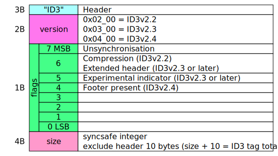
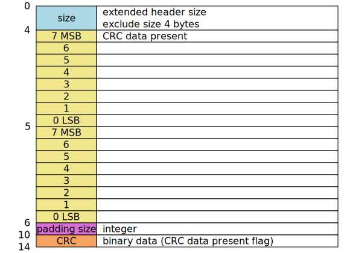
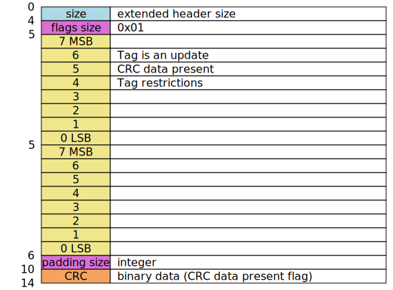

- [ID3v2.2](#id3v22)
  - [frame](#frame)
- [ID3v2.3](#id3v23)
  - [extended header](#extended-header)
  - [frame](#frame-1)
- [ID3v2.4](#id3v24)
  - [extended header](#extended-header-1)
  - [frame](#frame-2)
  - [footer](#footer)

# values

Text = "XXXX"\
Integers = $ xx xx xx xx\
Synchsafe integers = %0xxxxxxx 0xxxxxxx 0xxxxxxx 0xxxxxxx\
($ xx is hexa number, %xxxxxxxx is binary number)

# ID3v2.2

https://id3.org/id3v2-00

| length | name    | value              | info                                      |
| -----: | :------ | :----------------- | :---------------------------------------- |
|        |         |                    | start of file                             |
|      3 | header  | "ID3"              |                                           |
|      2 | version | $ 02 00            |                                           |
|      1 | flags   | %ab000000          | a = unsynchronisation b = compression |
|      4 | size    | Synchsafe integers | exclude header (10 Bytes)                 |
|   size | frames  |                    |                                           |

## frame

| length | name             | value    | info                     |
| -----: | :--------------- | :------- | :----------------------- |
|      3 | frame identifier | Text     | A-Z and 0-9              |
|      3 | frame size       | Integers | exclude header (6 Bytes) |
|   size | frame data       |          |

# ID3v2.3

https://id3.org/d3v2.3.0

| length | name            | value              | info                                                                         |
| -----: | :-------------- | :----------------- | :--------------------------------------------------------------------------- |
|        |                 |                    | start of file                                                                |
|      3 | header          | "ID3"              |                                                                              |
|      2 | version         | $ 03 00            |                                                                              |
|      1 | flags           | %abc00000          | a = Unsynchronisation b = Extended header c = Experimental indicator |
|      4 | size            | Synchsafe integers | exclude header (10 Bytes)                                                    |
|     ex | extended header |                    | if flag b is 1                                                               |
|     fr | frames          |                    |                                                                              |

## extended header

| length | name                 | value              | info                   |
| -----: | :------------------- | :----------------- | :--------------------- |
|      4 | extended header size | Integers           | exclude size (4 Bytes) |
|      2 | flags                | %a0000000 00000000 | a = CRC data present   |
|      4 | padding size         | Integers           |                        |
|      4 | CRC                  | Byte datas         | if flag a is 1         |

## frame

| length | name        | value              | info                                                                                                                                          |
| -----: | :---------- | :----------------- | :-------------------------------------------------------------------------------------------------------------------------------------------- |
|      4 | frame ID    | Text               | A-Z and 0-9                                                                                                                                   |
|      4 | frame size  | Integers           | exclude header (10 Bytes)                                                                                                                     |
|      2 | frame flags | %abc00000 ijk00000 | a = Tag alter preservation b = File alter preservation c = Read only i = Compression j = Encryption k = Grouping identity |
|   size | frame data  |                    |                                                                                                                                               |

# ID3v2.4

https://id3.org/id3v2.4.0-structure
https://id3.org/id3v2.4.0-frames

| length | name            | value              | info                                                                                                |
| -----: | :-------------- | :----------------- | :-------------------------------------------------------------------------------------------------- |
|        |                 |                    | start of file                                                                                       |
|      3 | header          | "ID3"              |                                                                                                     |
|      2 | version         | $ 04 00            |                                                                                                     |
|      1 | flags           | %abcd0000          | a = Unsynchronisation b = Extended header c = Experimental indicator d = Footer present |
|      4 | size            | Synchsafe integers | exclude header (10 Bytes)                                                                           |
|     ex | extended header |                    | if flag b is 1                                                                                      |
|     fr | frames          |                    |                                                                                                     |
|     10 | footer          |                    | if flag d is 1                                                                                      |

## extended header

| length | name                 | value              | info                                                                                                                                                                                      |
| -----: | :------------------- | :----------------- | :---------------------------------------------------------------------------------------------------------------------------------------------------------------------------------------- |
|      4 | extended header size | Synchsafe integers | whole size (>= 6 Bytes)                                                                                                                                                                   |
|      1 | flags size           | $ 01               |
|      1 | flags                | %0bcd0000          | b = Tag is an update c = CRC data present d = Tag restrictions                                                                                                                    |
|      1 | b data size          | $ 00               | if flag b is 1                                                                                                                                                                            |
|      1 | c data size          | $ 05               | if flag c is 1                                                                                                                                                                            |
|      5 | c data               | Byte datas         | if flag c is 1                                                                                                                                                                            |
|      1 | d data size          | $ 01               | if flag d is 1                                                                                                                                                                            |
|      1 | d data               | %ppqrrstt          | p = Tag size restrictions q = Text encoding restrictions r = Text fields size restrictions s = Image encoding restrictions t = Image size restrictions if flag d is 1 |

## frame

| length | name                   | value              | info                                                                                                                                                                                                  |
| -----: | :--------------------- | :----------------- | :---------------------------------------------------------------------------------------------------------------------------------------------------------------------------------------------------- |
|      4 | frame ID               | Text               | A-Z and 0-9                                                                                                                                                                                           |
|      4 | frame size             | Synchsafe integers | exclude header (10 Bytes)                                                                                                                                                                             |
|      2 | frame flags            | %0abc0000 0h00kmnp | a = Tag alter preservation b = File alter preservation c = Read only h = Grouping identity k = Compression m = Encryption n = Unsynchronisation p = Data length indicator |
|     ad | additional information |                    |
|     dt | frame data             |                    |

## footer

| length | name    | value              | info                                                                                                |
| -----: | :------ | :----------------- | :-------------------------------------------------------------------------------------------------- |
|      3 | header  | "3DI"              |
|      2 | version | $ 04 00            |
|      1 | flags   | %abcd0000          | a = Unsynchronisation b = Extended header c = Experimental indicator d = Footer present |
|      4 | size    | Synchsafe integers | exclude header (10 Bytes)                                                                           |
