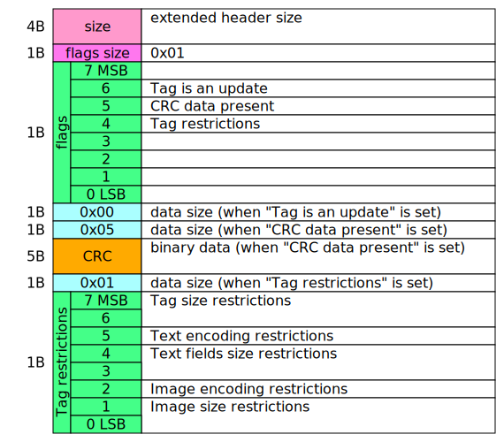
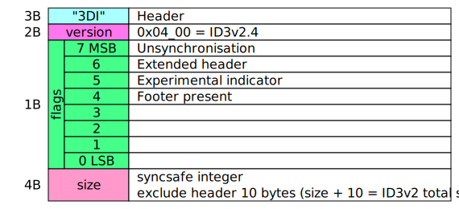

- [ID3v2.2](#id3v22)
  - [frame](#frame)
- [ID3v2.3](#id3v23)
  - [extended header](#extended-header)
  - [frame](#frame-1)
- [ID3v2.4](#id3v24)
  - [extended header](#extended-header-1)
  - [frame](#frame-2)
  - [footer](#footer)

`ID3v2` タグはおもに `MP3` 音楽ファイルのメタ情報を保存するために使われます。
`MP3` ファイルの最初に保存され、`"ID3"` で始まります。

# type

- **`int`**: 整数 (Integer)、ビッグエンディアン
- **`syncsafe int`**: 同期安全整数 (SuncSafe Integer)、ビッグエンディアン
  各バイトの最上位ビットが必ず0になります。
- **`str`**: 文字列、`ISO-8859-1` (`latin-1`) エンコード
- **`encode str`**: エンコード指定文字列
  - `0x00` の場合は `ISO-8859-1` (`latin-1`) エンコード
  - `0x01` の場合は `ISO/IEC 10646-1:1993` (`ucs-2`) エンコード
- **`str null`**: ヌル終端文字列
- **`encode str null`**: エンコード指定ヌル終端文字列
  - `latin-1` エンコードの場合は `0x00`
  - `ucs-2` エンコードの場合は `0x00 0x00`
- **`lang`**: 文字列、ISO-639-2
- **`url`**: 文字列

Text = "XXXX"\
Integers = $ xx xx xx xx\
Synchsafe integers = %0xxxxxxx 0xxxxxxx 0xxxxxxx 0xxxxxxx\
($ xx is hexa number, %xxxxxxxx is binary number)

# Header

| size | name | type |
| ---: | --- | --- |
| 3 | tag header | str |
| 1 | major version | int |
| 1 | revision version | int |
| 1 | flags | flag |
| 4 | size | syncsafe int |

- `ID3v2` タグはMP3ファイルの最初に保存されます。
- `tag header` は必ず `"ID3"` (`0x49 0x44 0x33`)で、 `ID3v2` タグが存在することを表します。
- `major version` はタグのバージョンです。
- `revision version` はタグのリビジョンバージョンです。
- `flags` はタグのフラグです。
  `0xabcd0000`
  - フラグ `a` がセットされた場合、非同期を使用します。
  - フラグ `b` がセットされた場合
    - `ID3v2.2` タグでは圧縮タグを使用します。
    - `ID3v2.3` `ID3v2.4` タグでは拡張ヘッダーを使用します。
  - フラグ `c` がセットされた場合、を使用します。
  - フラグ `d` がセットされた場合、を使用します。
- `size` はヘッダー (10バイト) を除いたタグのサイズです。同期安全整数を使用します。

- Version represents the version of the tag.
  Different versions are not compatible.
  - `0x02` = ID3v2.2
  - `0x03` = ID3v2.3
  - `0x04` = ID3v2.4
- Can be read by applications that support larger revision versions of tags. (backward compatibility)
- Size does not include common header and footer.

# Extended Header

Extended header added in v2.3.
It is present when the "Extended header" flag of the common header is set.

## ID3v2.3 Extended Header

## ID3v2.3 Extended Header

# Footer

## ID3v2.4 Footer

# Frame

## ID3v2.2 frame header

| size | name | type |
| ---: | --- | --- |
| 3 | frame id | str |
| 3 | frame size | int |

- `frame id` は大文字 `A-Z` または数字 `0-9` の文字列です。
- `frame size` はヘッダー (6バイト) を除いたフレームのサイズです。
  フレームのサイズは1バイトより大きい必要があります。

# Unique file identifier フレーム

## ID3v2.2 `"UFI"`

| size | name | type |
| ---: | --- | --- |
| 3 | frame id | str |
| 3 | frame size | int |
|   | owner id | str null |
| < 64 | id | bytes |

- Unique file identifier フレームはデータベース内でオーディオファイルの情報の識別子を保存します。
- `frame id` は `"UFI"` です。
- `owner id` はデータベースの識別子です。
  長さが0の場合はこのフレームは無視されます。
  同じ `owner id` を持つ UFI フレームはファイルに一つだけです。
- `id` はデータベース内のオーディオファイルの識別子です。

# Text information フレーム

## ID3v2.2 `"T00" - "TZZ"` 

| size | name | type |
| ---: | --- | --- |
| 3 | frame id | str |
| 3 | frame size | int |
| 1 | encoding | byte |
|   | information | encode str |

- Text information フレームはテキスト情報を保存します。
- `frame id` は `"T00" - "TZZ"` から `"TXX"` を除くいずれかです。
- `encoding` は文字列のエンコードです。
  - `0x00` の場合は `latin-1` です。
  - `0x01` の場合は `ucs-2` です。
- `information` はテキスト情報です。

### 詳細

- `"TT1"` - コンテンツグループ
- `"TT2"` - タイトル/曲名/コンテンツ
- `"TT3"` - サブタイトル/説明
- `"TP1"` - リードアーティスト/リードパフォーマー/ソリスト/パフォーミンググループ
  `"/"` の文字で区切られます。
- `"TP2"` - バンド/オーケストラ/伴奏
- `"TP3"` - 指揮者
- `"TP4"` - 解釈/リミックス
- `"TCM"` - 作曲者
  `"/"` の文字で区切られます。
- `"TXT"` - 作詞者/テキストライター
  `"/"` の文字で区切られます。
- `"TLA"` - 言語コード ISO-639-2
- `"TCO"` - コンテンツタイプ
  `"("` と `")"` で囲ってID3v1.1のジャンルやID3v2のコンテンツタイプを参照できます。
  `"("` で開始する場合は `"(("` で開始します。
  - `"(RX)"` Remix
  - `"(CR)"` Cover
- `"TAL"` - アルバム/映画/番組タイトル
- `"TPA"` - セットの部分
  `"TAL"` フレームのどの部分から来たのかを説明します。
  `"/" 総数` で拡張できます。
- `"TRK"` - トラック番号/セット内の位置
  `"/" 総数` で拡張できます。
- `"TRC"` - 国際標準レコーディングコード(ISRC)
- `"TYE"` - 年 YYYY
  常に四文字です。
- `"TDA"` - 日付 MMDD
  常に四文字です。
- `"TIM"` - 時刻 HHMM
  常に四文字です。
- `"TRD"` - 記録日
- `"TMT"` - メディアタイプ
- `"TFT"` - ファイルタイプ
- `"TBP"` - BPM
- `"TCR"` - 著作権メッセージ
- `"TPB"` - 出版社
- `"TEN"` - エンコード者
- `"TSS"` - エンコード ソフトウェア/ハードウェア/設定
- `"TOF"` - オリジナルファイル名
- `"TLE"` - 音楽の長さ
- `"TSI"` - タグを除いたファイルサイズ
- `"TDY"` - プレイリストディレイ
- `"TKE"` - 開始キー
- `"TOT"` - オリジナル アルバム/映画/番組タイトル
- `"TOA"` - オリジナル アーティスト/パフォーマー
- `"TOL"` - オリジナル 作詞者/テキストライター
- `"TOR"` - オリジナル リリース年

# User defined text information フレーム

## ID3v2.2 `"TXX"` 

| size | name | type |
| ---: | --- | --- |
| 3 | frame id | str |
| 3 | frame size | int |
| 1 | encoding | byte |
|   | description | encode str null |
|   | value | encode str |

- Text information フレームはテキスト情報を保存します。
- `frame id` は `"TXX"` です。
- `encoding` は文字列のエンコードです。
  - `0x00` の場合は `latin-1` です。
  - `0x01` の場合は `ucs-2` です。
- `description` はフレームの説明です。同じ説明のフレームはファイルに一つだけです。
- `value` はフレームの値です。

# URL link フレーム

## ID3v2.2 `"TXX"` 

| size | name | type |
| ---: | --- | --- |
| 3 | frame id | str |
| 3 | frame size | int |
|   | url | encode str |

- URL link フレームはURLを保存します。
- `frame id` は `"W00" - "WZZ"` から `"WXX"` を除くいずれかです。
- `url` はURLです。

### 詳細

- `"WAF"` - 公式オーディオファイルWEBページ

  WAR
   The 'Official artist/performer webpage' frame is a URL pointing at
   the artists official webpage. There may be more than one "WAR" frame
   in a tag if the audio contains more than one performer.
   
  WAS
   The 'Official audio source webpage' frame is a URL pointing at the
   official webpage for the source of the audio file, e.g. a movie.
   
  WCM
   The 'Commercial information' frame is a URL pointing at a webpage
   with information such as where the album can be bought. There may be
   more than one "WCM" frame in a tag.
   
  WCP
   The 'Copyright/Legal information' frame is a URL pointing at a
   webpage where the terms of use and ownership of the file is described.
   
  WPB
   The 'Publishers official webpage' frame is a URL pointing at the
   official wepage for the publisher.

# ID3v2.2

https://id3.org/id3v2-00

| length | name    | value              | info                                      |
| -----: | :------ | :----------------- | :---------------------------------------- |
|        |         |                    | start of file                             |
|      3 | header  | "ID3"              |                                           |
|      2 | version | $ 02 00            |                                           |
|      1 | flags   | %ab000000          | a = unsynchronisation b = compression |
|      4 | size    | Synchsafe integers | exclude header (10 Bytes)                 |
|   size | frames  |                    |                                           |

## frame

| length | name             | value    | info                     |
| -----: | :--------------- | :------- | :----------------------- |
|      3 | frame identifier | Text     | A-Z and 0-9              |
|      3 | frame size       | Integers | exclude header (6 Bytes) |
|   size | frame data       |          |

# ID3v2.3

https://id3.org/d3v2.3.0

| length | name            | value              | info                                                                         |
| -----: | :-------------- | :----------------- | :--------------------------------------------------------------------------- |
|        |                 |                    | start of file                                                                |
|      3 | header          | "ID3"              |                                                                              |
|      2 | version         | $ 03 00            |                                                                              |
|      1 | flags           | %abc00000          | a = Unsynchronisation b = Extended header c = Experimental indicator |
|      4 | size            | Synchsafe integers | exclude header (10 Bytes)                                                    |
|     ex | extended header |                    | if flag b is 1                                                               |
|     fr | frames          |                    |                                                                              |

## extended header

| length | name                 | value              | info                   |
| -----: | :------------------- | :----------------- | :--------------------- |
|      4 | extended header size | Integers           | exclude size (4 Bytes) |
|      2 | flags                | %a0000000 00000000 | a = CRC data present   |
|      4 | padding size         | Integers           |                        |
|      4 | CRC                  | Byte datas         | if flag a is 1         |

## frame

| length | name        | value              | info                                                                                                                                          |
| -----: | :---------- | :----------------- | :-------------------------------------------------------------------------------------------------------------------------------------------- |
|      4 | frame ID    | Text               | A-Z and 0-9                                                                                                                                   |
|      4 | frame size  | Integers           | exclude header (10 Bytes)                                                                                                                     |
|      2 | frame flags | %abc00000 ijk00000 | a = Tag alter preservation b = File alter preservation c = Read only i = Compression j = Encryption k = Grouping identity |
|   size | frame data  |                    |                                                                                                                                               |

# ID3v2.4

https://id3.org/id3v2.4.0-structure
https://id3.org/id3v2.4.0-frames

| length | name            | value              | info                                                                                                |
| -----: | :-------------- | :----------------- | :-------------------------------------------------------------------------------------------------- |
|        |                 |                    | start of file                                                                                       |
|      3 | header          | "ID3"              |                                                                                                     |
|      2 | version         | $ 04 00            |                                                                                                     |
|      1 | flags           | %abcd0000          | a = Unsynchronisation b = Extended header c = Experimental indicator d = Footer present |
|      4 | size            | Synchsafe integers | exclude header (10 Bytes)                                                                           |
|     ex | extended header |                    | if flag b is 1                                                                                      |
|     fr | frames          |                    |                                                                                                     |
|     10 | footer          |                    | if flag d is 1                                                                                      |

## extended header

| length | name                 | value              | info                                                                                                                                                                                      |
| -----: | :------------------- | :----------------- | :---------------------------------------------------------------------------------------------------------------------------------------------------------------------------------------- |
|      4 | extended header size | Synchsafe integers | whole size (>= 6 Bytes)                                                                                                                                                                   |
|      1 | flags size           | $ 01               |
|      1 | flags                | %0bcd0000          | b = Tag is an update c = CRC data present d = Tag restrictions                                                                                                                    |
|      1 | b data size          | $ 00               | if flag b is 1                                                                                                                                                                            |
|      1 | c data size          | $ 05               | if flag c is 1                                                                                                                                                                            |
|      5 | c data               | Byte datas         | if flag c is 1                                                                                                                                                                            |
|      1 | d data size          | $ 01               | if flag d is 1                                                                                                                                                                            |
|      1 | d data               | %ppqrrstt          | p = Tag size restrictions q = Text encoding restrictions r = Text fields size restrictions s = Image encoding restrictions t = Image size restrictions if flag d is 1 |

## frame

| length | name                   | value              | info                                                                                                                                                                                                  |
| -----: | :--------------------- | :----------------- | :---------------------------------------------------------------------------------------------------------------------------------------------------------------------------------------------------- |
|      4 | frame ID               | Text               | A-Z and 0-9                                                                                                                                                                                           |
|      4 | frame size             | Synchsafe integers | exclude header (10 Bytes)                                                                                                                                                                             |
|      2 | frame flags            | %0abc0000 0h00kmnp | a = Tag alter preservation b = File alter preservation c = Read only h = Grouping identity k = Compression m = Encryption n = Unsynchronisation p = Data length indicator |
|     ad | additional information |                    |
|     dt | frame data             |                    |

## footer

| length | name    | value              | info                                                                                                |
| -----: | :------ | :----------------- | :-------------------------------------------------------------------------------------------------- |
|      3 | header  | "3DI"              |
|      2 | version | $ 04 00            |
|      1 | flags   | %abcd0000          | a = Unsynchronisation b = Extended header c = Experimental indicator d = Footer present |
|      4 | size    | Synchsafe integers | exclude header (10 Bytes)                                                                           |

# 参照リンク

- [ID3v2.2 standard](https://id3.org/id3v2-00)
- [ID3v2.3 stamdard](https://id3.org/d3v2.3.0)
- [ID3v2.4 structure](https://id3.org/id3v2.4.0-structure)
- [ID3v2.4 frames](https://id3.org/id3v2.4.0-frames)
